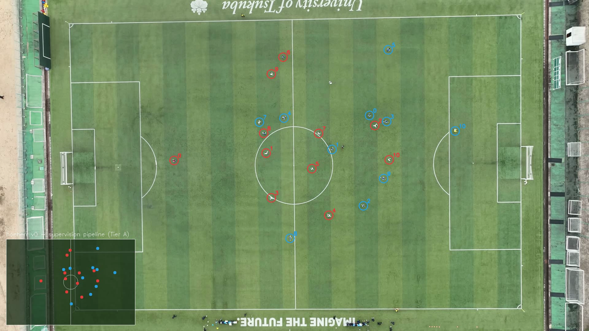
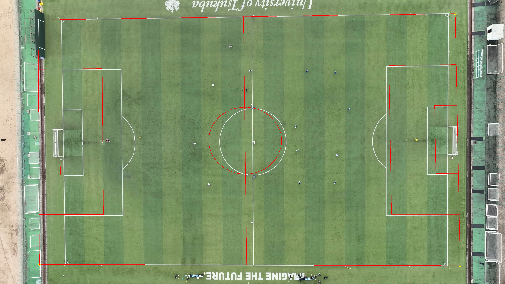

# höherr — Drohnenbasierte Fußballanalyse

**Profi-Analytics für Amateurvereine.** Eine Drohne über dem Platz, eine KI-Pipeline
dahinter — und jeder Spieler bekommt nach dem Spiel einen Entwicklungsbericht, wie ihn
sonst nur Profis sehen. Ein Flug analysiert das ganze Team.

> Produkt-Demo: [hoeherr-v1.vercel.app](https://hoeherr-v1.vercel.app) ·
> Gründer: Mustafa Kaan (höherr) · Tech-Partner: Quershift Technologies



## Status: v0-Pipeline läuft und ist validiert ✅

Die Kern-Pipeline (Drohnenvideo → Erkennung → Tracking → Spielfeld-Koordinaten →
Metriken → Spieler-Report) läuft End-to-End und ist **gegen Ground-Truth gemessen**
(TeamTrack-Datensatz, echtes Nadir-Drohnenmaterial, 5 Minuten kontinuierlich, 22 Spieler):

| Kennzahl | Wert |
|---|---|
| Spieler-Erkennung (Raw-Recall) | **0,99** |
| Tracking-Recall | **0,92** |
| Positionsgenauigkeit (RMSE) | **0,41 m** |
| Laufdistanz-Fehler (Median) | **10,6 %** |
| Läuft auf | **MacBook (Apple Silicon)** — kein Cluster nötig |

Damit sind die Tier-A-Metriken produktionsnah: **Laufdistanz, Top-Speed, Sprints,
High-Speed-Running, Heatmaps, Durchschnittspositionen, Mitspieler-Abstände,
Team-Kompaktheit** — pro Spieler, pro Spiel. Der Report-Output entspricht 1:1 dem
Datenformat der [hoeherr-v1-Produktseite](https://hoeherr-v1.vercel.app/#report/development)
(Beispiel: [`docs/results/report_player.json`](docs/results/report_player.json)).

🎬 **[30-Sekunden-Demo ansehen](docs/demo_30s.mp4)** — alle 22 Spieler getrackt, mit Live-Radar.

## Warum das schwer war (und was gelöst ist)

1. **Standard-KI erkennt keine Menschen von oben.** COCO-YOLO findet aus der
   Drohnen-Senkrechten **0 von 22 Spielern**. Unser Fine-Tune auf Drohnen-Daten
   (TeamTrack, MIT-Lizenz) hebt das auf 99 % — Training dauert 18 Minuten auf einem
   MacBook. Gewichte liegen in [`models/`](models/).
2. **Tracking bricht bei winzigen, schnellen Objekten.** Ein sprintender Spieler
   bewegt sich pro Frame um seine eigene Boxbreite — klassische IoU-Tracker verlieren
   ihn sofort. Gelöst mit Buffered-IoU-Assoziation + Duplikat-Bereinigung +
   Gap-Stitching ([`pipeline/retrack.py`](pipeline/retrack.py)), Tracking-Tuning läuft
   offline in Sekunden statt in GPU-Stunden.
3. **Pixel sind keine Meter.** Automatische Spielfeld-Kalibrierung über
   Linienerkennung — die Feldmaße werden aus den genormten Strafraum-Maßen
   abgeleitet ([`pipeline/auto_calibrate.py`](pipeline/auto_calibrate.py)).



## Quickstart (lokal, Apple Silicon)

```bash
uv venv --python 3.12
uv pip install --python .venv/bin/python supervision ultralytics pandas pyarrow scipy gdown
# Daten holen (TeamTrack soccer_top, ~500 MB):
.venv/bin/python pipeline/download_teamtrack.py
# danach: pipeline/README.md — Schritt für Schritt vom Video zum Report
```

Detaillierte Pipeline-Doku inkl. aller getunten Parameter und der
GT-Validierungs-Methodik: [`pipeline/README.md`](pipeline/README.md)

## Repo-Struktur

| Pfad | Inhalt |
|---|---|
| `pipeline/` | **v0-Pipeline (validiert)** — der kanonische Pfad vom Video zum Report |
| `models/` | Fine-tuned YOLO-Gewichte (Drohnen-Nadir, TeamTrack-Kacheln) |
| `docs/` | Roadmap, Validierungs-Ergebnisse, Demo-Video, Bilder |
| `src/`, `scripts/`, `configs/` | Trainings-Framework & Experimente (v1–v5, SAHI-Eval, Cluster-Vorbereitung) |
| `api/` | Web-API-Skeleton für den späteren Upload-Service |
| `tests/` | Unit-Tests für Metriken, Homography, Team-Klassifikation |

## Roadmap

- ✅ **Phase 0–1: Machbarkeit + lokale v0-Pipeline** — GT-validiert (dieser Stand)
- 🔜 **Phase 2: Qualität auf <5 % Distanzfehler** — 30-Hz-Sampling, größeres Modell,
  mehr Trainingsdaten (GPU-Cluster)
- 🔜 **Phase 3: Spieler-Identität** — Track-Konsolidierung + Review-UI (≤10 min/Spiel)
- 🔜 **Phase 4: Echtes Drohnenmaterial** — Testspiel-Aufnahme, Active-Learning-Loop
- 🔜 **Phase 5: Ganze Spiele in der Cloud** — Chunk-Parallelisierung, Ziel ~1–2 €
  GPU-Kosten und ~30 min Durchlauf pro Spiel
- 🔮 **Tier B: Ball & Possession** — Passoptionen, Pressing, Entscheidungs-Timeline

Vollständige Architektur & Validation-Contract: [`docs/ROADMAP_FULL_GAME.md`](docs/ROADMAP_FULL_GAME.md)
